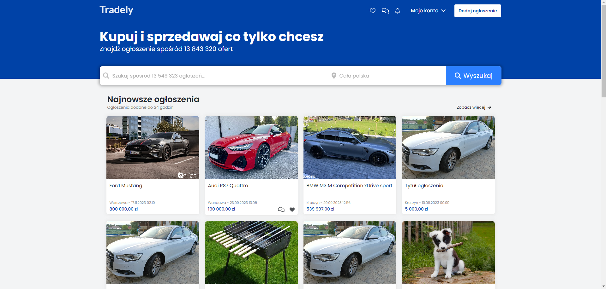
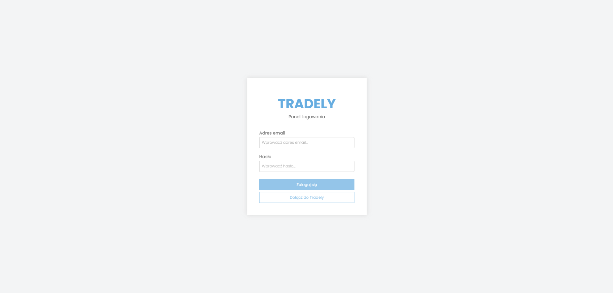
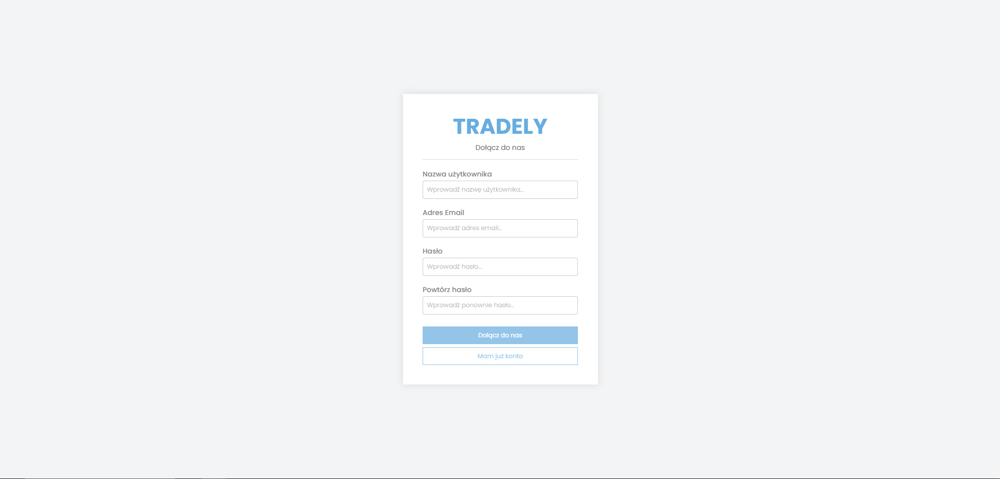
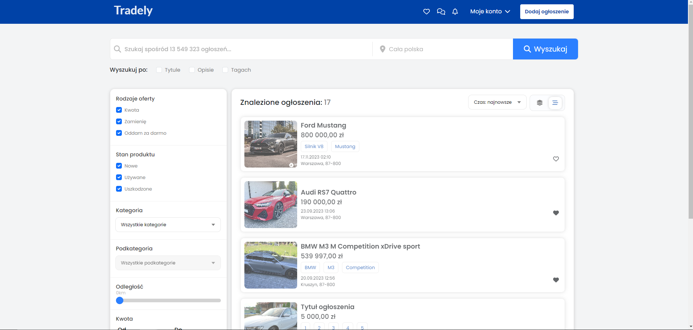
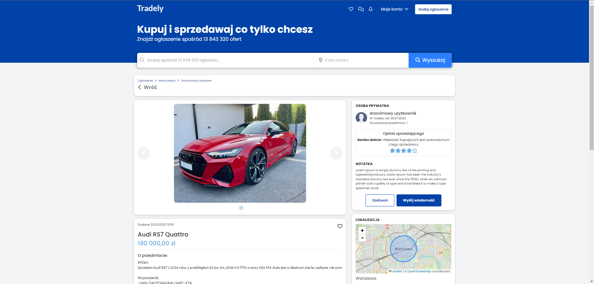
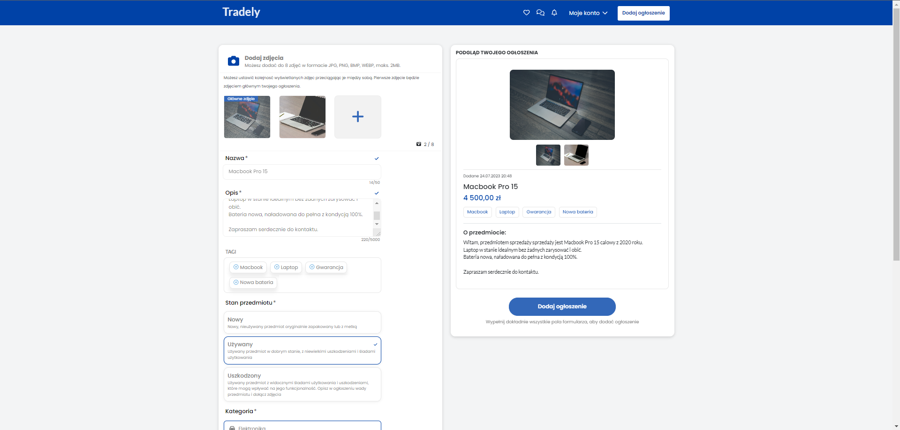
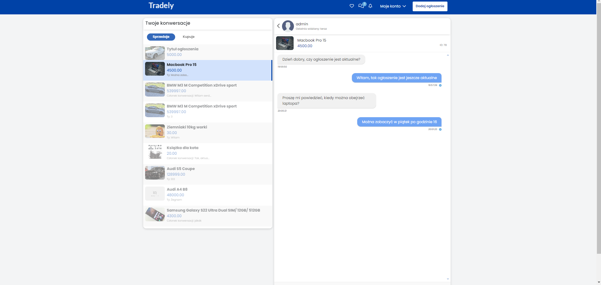
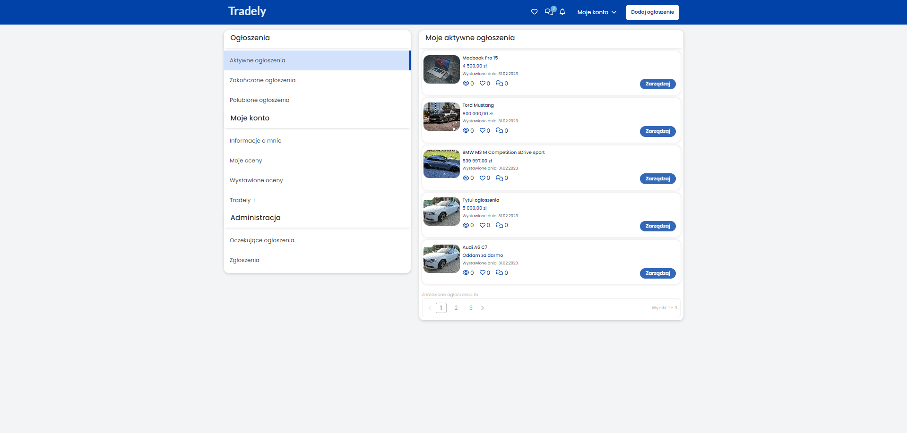
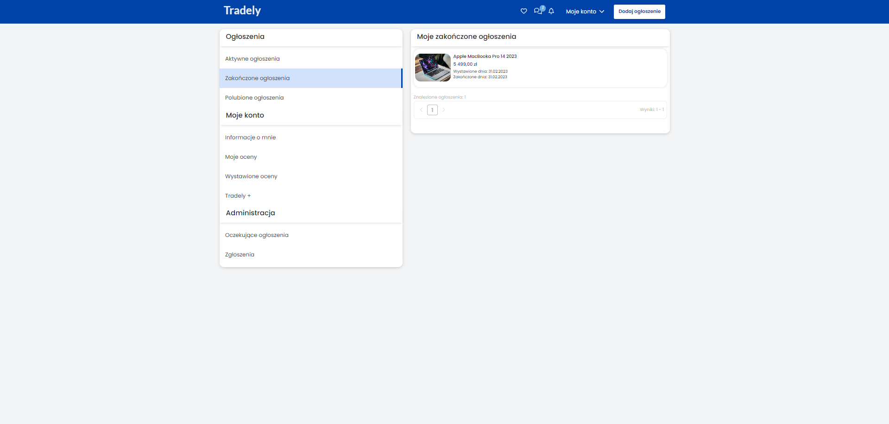

# Tradely Front-end



Tradely is a dynamic web application designed to allow users to add and browse advertisements. It is a classifieds portal aimed at showcasing skills in creating advanced web applications.

With Tradely, users can easily add new advertisements, browse existing listings, and use search functionality to find products or services of interest. The application is built using a wide range of technologies, including HTML, CSS, and JavaScript, which form the foundation of the user interface.

What sets Tradely apart are its advanced front-end features implemented using popular libraries and frameworks such as React and Redux. This ensures the application offers users a smooth and interactive browsing experience.

Additionally, communication between the front-end and back-end is handled through an API, allowing efficient data transfer between different layers of the application. This approach facilitates easy scaling and expansion of Tradely's functionalities in the future.

## Application Features:
-  Account login and registration system.
-  Ability to add free advertisements, including for sale, exchange, and free offers.
-  Search functionality with dynamic filters tailored to each category and subcategory.
-  Search advertisements by location.
-  Live chat based on WebSockets using Laravel technology.
-  Features to like advertisements and manage them.
-  Individual permissions and administrative roles, allowing for editing, deleting advertisements, blocking users, and reporting content.

## Installation and Setup

A step by step series of examples that tell you how to get a development
environment running


- Clone the repository:

```
git clone https://github.com/milosz1532/tradely-frontend.git
```

- Navigate to the project directory:

```
cd tradely-frontend
```

- Install dependencies:

```
npm install
```

- Start the development server:

```
npm run dev
```


## Technologies Used:
- React.js
- Redux
- React-router
- Axios
- Bootstrap
- SCSS
- FontAwesome

[](https://skillicons.dev)

## Backend

The backend was developed by me using Laravel, and the project is available as a separate repository at: https://github.com/Milosz1532/tradely-backend.

## Application Screenshots:
















